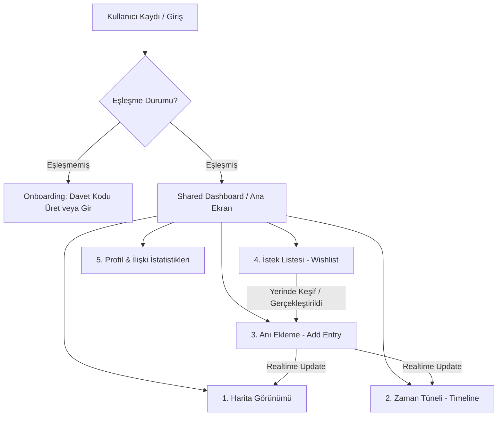
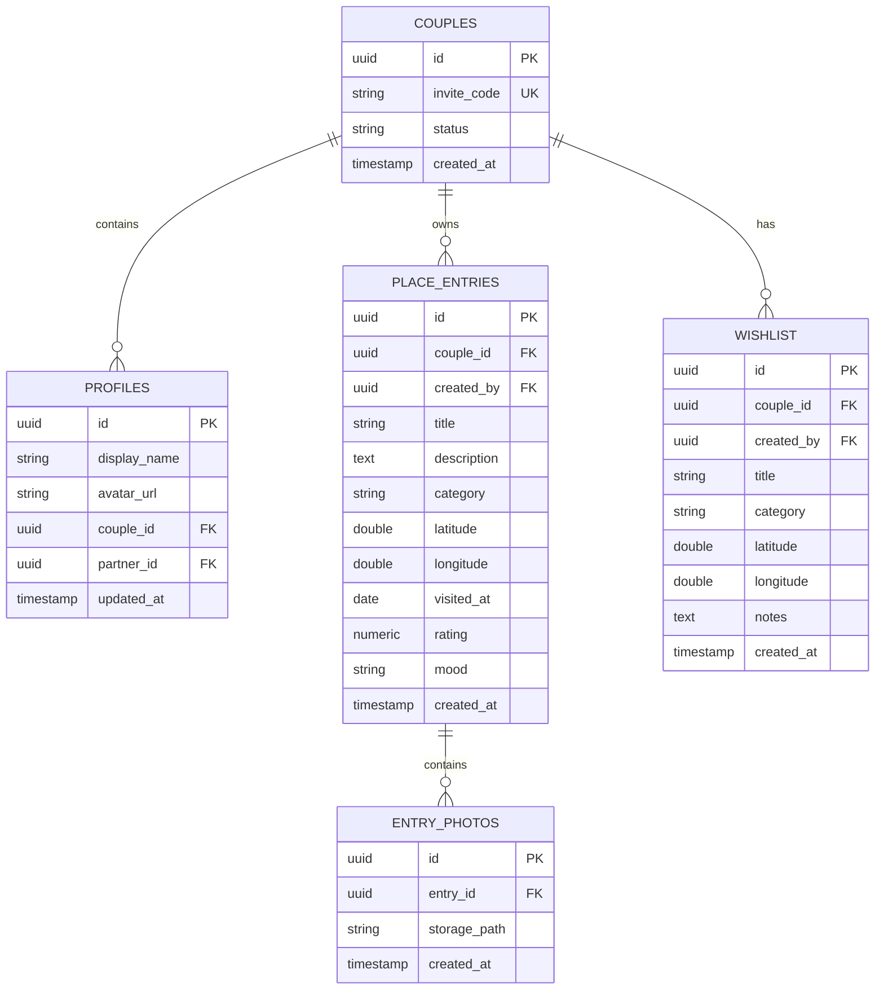

# PRD.md

## Product Requirements Document

### Product Name
**Bizim Harita** *(working title)*

---

# 1. Overview

## Product Summary

Bizim Harita, çiftlerin birlikte gittikleri yerleri, yaşadıkları deneyimleri ve oluşturdukları anıları kayıt altına alabildiği, tamamen onlara özel, korunaklı bir dijital platformdur.

Kullanıcılar:
- Birlikte gittikleri mekanları (kafe, restoran, park vb.) harita üzerinde pinleyebilir,
- Bu mekanlara anı fotoğrafları, ses notları ve duygusal notlar ekleyebilir,
- Kronolojik bir timeline üzerinde geçmiş anılarını görsel olarak canlandırabilir,
- Gelecekte gitmek istedikleri yerleri ortak bir wishlist’e ekleyip haritada planlayabilir,
- Partnerinin uygulamadaki anlık etkileşimlerini (haritada nereye baktığı, ne eklediği vb.) hissedebilir.

Ürünün temel amacı:
> “İlişkilerin zamansal, mekansal ve duygusal dijital hafızasını oluşturmak.”

---

# 2. Problem Statement

Çiftler, birlikte geçirdikleri özel anları ve keşfettikleri yerleri düzenli, sadece kendilerine ait ve estetik bir biçimde saklayamıyor.

Mevcut çözümler ve eksiklikleri:
- **Google Maps saved places:** Fazlasıyla mekanik, duygu barındırmıyor, fotoğraf ve not ekleme süreçleri pratik değil.
- **Instagram collections:** Sadece görsel odaklı, harita ve timeline entegrasyonu yok, dış dünyaya çok açık.
- **Notes apps (Notion, Apple Notes):** Görsel olarak zayıf, konum bazlı etkileşimi sıfır, ortak yönetim zor.
- **Fotoğraf galerileri:** Konum ve hikaye bağlamından kopuk, zamanla binlerce fotoğraf arasında kayboluyor.
- **WhatsApp mesajları / Pinlenen konumlar:** Sohbet akışı içinde kaybolup gidiyor, yapılandırılmış bir arşiv sunmuyor.

### Sonuç:
Kullanıcılar anılarını organize etmekte zorlanıyor, ilişkilerinin dijital geçmişi parçalanıyor ve zaman içinde birçok kıymetli deneyim unutuluyor.

---

# 3. Vision

Çiftlerin birlikte yaşadıkları anıları **zamansal (Timeline)**, **mekansal (Map)** ve **duygusal (Mood & Memories)** olarak organize edebildiği, dünyanın en samimi, estetik ve güvenli çift odaklı platformu olmak.

---

# 4. Goals

## Primary Goals (Birincil Hedefler)
- **Kolay ve Hızlı Kayıt:** Çiftlerin gittikleri yerleri minimum eforla (konum otomatik tamamlama, akıllı varsayılanlar) kaydedebilmesi.
- **Ortak Dijital Hafıza:** İki kişinin katkılarıyla zenginleşen ortak bir anı arşivi oluşturulması.
- **Harita Bazlı Görsel Keşif:** Geçmiş deneyimlerin harita üzerinde estetik pinlerle sergilenmesi.
- **Kronolojik Hikayeleştirme:** Timeline üzerinden anıların estetik kartlar ve albüm görünümleriyle akması.

## Secondary Goals (İkincil Hedefler)
- **Yüksek Retention (Bağlılık):** Yıllık özetler (Recap), yıl dönümü hatırlatıcıları ve ortak hedeflerle uygulamaya sürekli dönüş sağlanması.
- **Duygusal Bağ ve Sahiplenme:** Sıcak renk paletleri, mikro animasyonlar ve kişiselleştirilebilir alanlarla uygulamayı bir "dijital ev" hissiyle doldurmak.
- **Partner Realtime Etkileşimi:** Eş zamanlı kullanımda partnerin varlığını hissettiren interaktif dokunuşlar.

---

# 5. Target Audience

## Primary Audience
20–35 yaş arası, ilişkisini önemseyen, teknolojiye adapte ve birlikte keşfetmeyi seven çiftler.

### Characteristics (Kullanıcı Özellikleri)
- Aktif sosyal yaşama sahip; yeni nesil kahvecileri, restoranları, sergileri ve seyahat rotalarını takip ediyor.
- Estetiğe ve tasarıma önem veriyor (Instagram, VSCO, Pinterest kullanıcısı).
- Birlikte seyahat etmeyi ve yeni şehirler/doğa rotaları keşfetmeyi seviyor.
- Fotoğraf ve video çekerek anı biriktirmekten hoşlanıyor.
- İlişkisinde ortak paylaşımlara ve ritüellere değer veriyor.

---

# 6. Product Scope & UX Flow Architecture

Senior Product Designer gözüyle tasarlanmış kullanıcı akışı mimarisi:



---

# 7. MVP Features (Geliştirilmiş ve Detaylandırılmış)

## 7.1 Authentication & Onboarding (Supabase Auth)
- **Email/Password & Google OAuth:** Hızlı ve güvenli giriş.
- **Session Persistence:** Kullanıcının sürekli giriş yapmak zorunda kalmaması (mobil öncelikli web app için kritik).
- **Onboarding Flow:** İlişki başlangıç tarihi, profil fotoğrafları ve ortak bir arka plan rengi/teması seçimiyle kişiselleştirilmiş başlangıç.

## 7.2 Couple Space System & Realtime Pairing (Çift Alanı)
- **Eşleşme Akışı (Pairing Flow):**
  - Kullanıcı benzersiz bir `Invite Code` üretir ve bunu tek tıkla (WhatsApp/SMS Share API kullanarak) partnerine gönderir.
  - Partner kodu girerek daveti onaylar. Eşleşme anında ekranda **Micro-interactions (Konfeti & Kalp animasyonları)** tetiklenir.
- **Realtime Sync (Supabase Realtime):**
  - Partnerlerden biri yeni bir anı eklediğinde veya wishlist'e yer kaydettiğinde, diğer partnerin ekranı yenilenmeye gerek kalmadan anında güncellenir.
  - **Partner Presence (Aktiflik Göstergesi):** Partner o an haritada veya uygulamada aktifse, profil resmi üzerinde tatlı bir parlama efekti belirir.

## 7.3 Add Place Entry (Anı Ekleme Portalı)
Tasarım ilkesi: **Sıfır Sürtünme (Zero Friction).** Kullanıcı sokakta yürürken veya mekandan çıkarken anıyı 5 saniyede ekleyebilmelidir.
- **Google Places Autocomplete / Mapbox Search:** Mekan adı yazıldığı an adres, koordinat ve kategori bilgileri otomatik tamamlanır.
- **Required Fields:**
  - Place Name (Mekan Adı)
  - Category (Kategori seçimi - Akıllı ikonlarla)
  - Visit Date (Ziyaret Tarihi - Varsayılan: Bugün)
  - Rating (1-5 Kalp/Yıldız Derecelendirmesi)
- **Optional / Emotional Fields (Tasarım Odaklı):**
  - Description / Memory Note (Duygusal notlar)
  - Photos (Sürükle bırak veya mobilden doğrudan kamera erişimiyle çoklu yükleme)
  - Mood Tag (Romantik, Macera, Huzurlu, Keyifli vb.)
- **Categories:**
  * Restaurant, Cafe, Event, Museum, Travel, Hotel, Bar, Nature, Cinema, Dessert, Special (Yıl dönümü, ilk buluşma yeri vb.)

## 7.4 Map View (Anı Haritası)
- **Custom Mapbox Styling:** Standart haritalardan uzak, sıcak toprak tonlarında veya şık gece modunda romantik bir harita stili.
- **Interactive Pins:** Kategorilere göre değişen renk ve ikonlara sahip pinler. Üzerine tıklandığında açılan estetik, yumuşak geçişli **Detail Card Drawer** (mobil için aşağıdan açılan çekmece).
- **Filteleme & Arama:** Kategoriye, ziyaret tarihine veya ekleyen kişiye göre filtreleme imkanı.
- **Clustering (Kümeleme):** Aynı şehirde çok fazla anı varsa, bunları temiz bir sayı balonuyla gruplayıp yakınlaşınca dağıtma.

## 7.5 Timeline View (Zaman Tüneli)
- **Chronological albüm görünümü:** Sosyal medya akışlarından ilham alan ama tamamen kişiye özel ve reklamsız temiz bir akış.
- **Date Grouping:** "Aralık 2025", "Yaz Tatili Rotası" gibi zamansal gruplamalar.
- **Memory Cards:** İçerisinde fotoğrafların, rating'in, ekleyen partnerin avatarının ve duygu etiketinin bulunduğu kart tasarımları.
- **Milestones (Dönüm Noktaları):** "İlk Buluşma", "Nişan Günü", "İlk Ortak Seyahat" gibi özel anıların akışta daha büyük ve parıltılı sınırlarla vurgulanması.

## 7.6 Shared Wishlist (Gelecek Planları)
- **Bucket List Deneyimi:** Gitmek istenen mekanların harita üzerinde gri/yarı saydam pinlerle gösterilmesi.
- **"Been Here!" Butonu:** Wishlist'teki bir mekana gidildiğinde, tek tıkla fotoğraf ve not ekleme ekranına aktarılarak "Ziyaret Edilen Anı"ya dönüştürülmesi.
- **Shared View:** Ortak istek listesi üzerinde partnerlerin birbirlerinin eklediği yerleri görebilmesi ve "buna kesin gidelim" reaksiyonu verebilmesi (realtime kalp emojisi).

## 7.7 Photo Memories & Storage
- **Optimized Upload:** Görsellerin yüklenirken istemci tarafında sıkıştırılması, WebP formatına dönüştürülmesi (Supabase Storage'da yer kazanmak ve hızlı yüklenmesini sağlamak amacıyla).
- **Carousel Gallery:** Mekan detayında fotoğrafların tam ekran, kaydırmalı estetik galeri modunda incelenmesi.

---

# 8. Post-MVP Features (Gelecek Yol Haritası Önerileri)

## 8.1 Relationship Stats (Bizim İstatistiklerimiz)
- "Birlikte en çok gittiğimiz kategori" (Örn: %40 Kahve, %30 Doğa)
- "Keşfettiğimiz şehir sayısı"
- "Bu ay biriktirdiğimiz anı sayısı"
- "Favori mekanımız" (Ziyaret sıklığına göre otomatik hesaplanır)

## 8.2 Annual Recap (Yıllık Aşk Özeti)
- Her yılın sonunda (1 Ocak) çiftlere özel sunulan, müzikli ve animasyonlu "Yılın Anı Hikayesi" (Spotify Wrapped konsepti).
- PDF veya görsel olarak sosyal medyada paylaşılabilir şablonlar (isteğe bağlı dışa aktarma).

## 8.3 Mood Tracking & Relationship Weather
- Çiftlerin o anki modlarını ve ilişkideki genel enerjilerini haritaya yansıtabildikleri, tatlı emojilerle desteklenmiş durum paylaşımı.

## 8.4 AI Date Night Generator
- Supabase üzerindeki geçmiş mekan ve rating tercihlerine göre, yapay zeka destekli "Bu hafta sonu nereye gitmelisiniz?" öneri motoru.

## 8.5 Shared Trip Planner
- Hafta sonu kaçamakları veya uzun seyahatler için ortak rota planlama katmanı. Haritada noktaları 1., 2. ve 3. gün olarak sıralama imkanı.

---

# 9. User Experience (UX) & Design Principles

Senior Product Designer olarak tasarım prensiplerimiz şunlardır:

1. **Emotional Safety & Privacy First (Duygusal Güvenlik):** Uygulamada dışa dönük hiçbir "beğeni sayısı", "takipçi" veya "sosyal baskı" unsuru olmayacaktır. Bu alan çiftin dijital sığınağıdır.
2. **Warm & Cozy Aesthetics (Sıcak ve Samimi Tasarım):** Keskin kurumsal soğuk mavi/grilerden kaçınılmalıdır. Krem tonları, pastel pembe/şeftali esintileri, yumuşak gölgeler, yuvarlatılmış köşeler (border-radius: 1rem+) ve "glassmorphism" efektleri tercih edilecektir.
3. **Micro-interactions:** Butonlara tıklandığında hafif haptic feedback hissi veren mikro animasyonlar, fotoğraf yüklerken beliren tatlı yükleme barları.
4. **Mobile-First Design:** Ekran tasarımları, alt navigasyon barı (Bottom Navigation Sheet) ve tek elle kullanıma uygun buton yerleşimleri ile tamamen mobil tarayıcılara göre optimize edilecektir.

---

# 10. Technical Requirements & Technology Stack

Projenin teknik altyapısı, modern web standartlarına, yüksek performansa ve hızlı geliştirme sürecine uygun olarak **TypeScript** dili ekosisteminde kurgulanmıştır.

## 10.1 Frontend (İstemci Tarafı)
- **Yazılım Dili:** **TypeScript (Strict Mode)** - Tip güvenliği, autocompletion avantajı ve hatasız veri akışı için.
- **Framework:** **Next.js 14+ (App Router)** - SEO avantajları, Server Components ile hızlı ilk yükleme ve optimize edilmiş routing mimarisi.
- **Styling:** **Tailwind CSS** - Hızlı ve modüler arayüz geliştirme.
- **UI Components:** **shadcn/ui** (Radix UI tabanlı) - Tamamen erişilebilir, özelleştirilebilir modern bileşen kütüphanesi.
- **Animations:** **Framer Motion** - Sayfa geçişleri, drawer açılışları ve mikro-etkileşimler için pürüzsüz animasyonlar.
- **State Management & Data Fetching:**
  - **Zustand:** İstemci tarafındaki hafif global durum yönetimi (örn: aktif filtreler, kullanıcı teması).
  - **TanStack Query (React Query) v5:** Supabase sorgularını önbelleğe alma, arka planda veri güncelleme (optimistic updates) ve senkronizasyon yönetimi.

## 10.2 Backend & Database (Supabase Ekosistemi)
- **Veri Tabanı:** **PostgreSQL (Supabase tarafından barındırılan)**.
- **Authentication:** **Supabase Auth** - JWT tabanlı oturum yönetimi, Google OAuth entegrasyonu.
- **Storage:** **Supabase Storage** - Anı fotoğraflarının saklandığı yüksek performanslı CDN destekli nesne depolama servisi (`photos` bucket'ı).
- **Realtime Services:** **Supabase Realtime (Presence & Broadcast)** - Çiftlerin anlık etkileşimleri ve eş zamanlı harita/timeline güncellemeleri için WebSockets altyapısı.
- **Güvenlik Politikası:** **PostgreSQL Row Level Security (RLS)** - Çiftlerin verilerinin diğer kullanıcılardan izole edilmesi ve yetkisiz erişimlerin veritabanı seviyesinde engellenmesi.

## 10.3 Maps & Location Services
- **Maps SDK:** **Mapbox GL JS** / **React Map GL** - Yüksek performanslı vektör haritalar ve özel harita tasarımı (Studio) desteği.
- **Geocoding & Search:** **Mapbox Search API** veya **Google Places API** - Mekan arama ve konum detaylarını çekme.

## 10.4 Hosting & CI/CD
- **Deployment Platform:** **Vercel** - Next.js ile tam uyumlu, edge network altyapılı hızlı hosting.

---

# 11. Database Schema & Data Model (Supabase/PostgreSQL)

Veritabanında **Row Level Security (RLS)** kurallarını tam işletebilmek ve veri bütünlüğünü korumak adına oluşturulan ilişkisel PostgreSQL veri modeli:



### 11.1 PostgreSQL Table DDL (Data Definition Language)

```sql
-- 1. COUPLES TABLE
CREATE TABLE couples (
    id UUID PRIMARY KEY DEFAULT gen_random_uuid(),
    invite_code VARCHAR(10) UNIQUE NOT NULL,
    status VARCHAR(20) DEFAULT 'pending' CHECK (status IN ('pending', 'active')),
    created_at TIMESTAMP WITH TIME ZONE DEFAULT TIMEZONE('utc'::text, NOW()) NOT NULL
);

-- 2. PROFILES TABLE (Linked with Supabase auth.users)
CREATE TABLE profiles (
    id UUID PRIMARY KEY REFERENCES auth.users(id) ON DELETE CASCADE,
    display_name VARCHAR(100),
    avatar_url TEXT,
    couple_id UUID REFERENCES couples(id) ON DELETE SET NULL,
    partner_id UUID REFERENCES profiles(id) ON DELETE SET NULL,
    updated_at TIMESTAMP WITH TIME ZONE DEFAULT TIMEZONE('utc'::text, NOW()) NOT NULL
);

-- 3. PLACE ENTRIES TABLE
CREATE TABLE place_entries (
    id UUID PRIMARY KEY DEFAULT gen_random_uuid(),
    couple_id UUID NOT NULL REFERENCES couples(id) ON DELETE CASCADE,
    created_by UUID NOT NULL REFERENCES profiles(id) ON DELETE CASCADE,
    title VARCHAR(255) NOT NULL,
    description TEXT,
    category VARCHAR(50) NOT NULL,
    latitude DOUBLE PRECISION NOT NULL,
    longitude DOUBLE PRECISION NOT NULL,
    visited_at DATE NOT NULL DEFAULT CURRENT_DATE,
    rating NUMERIC(2,1) CHECK (rating >= 1.0 AND rating <= 5.0),
    mood VARCHAR(50),
    created_at TIMESTAMP WITH TIME ZONE DEFAULT TIMEZONE('utc'::text, NOW()) NOT NULL
);

-- 4. ENTRY PHOTOS TABLE
CREATE TABLE entry_photos (
    id UUID PRIMARY KEY DEFAULT gen_random_uuid(),
    entry_id UUID NOT NULL REFERENCES place_entries(id) ON DELETE CASCADE,
    storage_path TEXT NOT NULL,
    created_at TIMESTAMP WITH TIME ZONE DEFAULT TIMEZONE('utc'::text, NOW()) NOT NULL
);

-- 5. WISHLIST TABLE
CREATE TABLE wishlist (
    id UUID PRIMARY KEY DEFAULT gen_random_uuid(),
    couple_id UUID NOT NULL REFERENCES couples(id) ON DELETE CASCADE,
    created_by UUID NOT NULL REFERENCES profiles(id) ON DELETE CASCADE,
    title VARCHAR(255) NOT NULL,
    category VARCHAR(50) NOT NULL,
    latitude DOUBLE PRECISION,
    longitude DOUBLE PRECISION,
    notes TEXT,
    created_at TIMESTAMP WITH TIME ZONE DEFAULT TIMEZONE('utc'::text, NOW()) NOT NULL
);
```

### 11.2 Row Level Security (RLS) Mantığı
Güvenliği veritabanı seviyesinde korumak adına tüm tablolarda RLS aktif edilecektir.
Örnek RLS Politikası (`place_entries` için):
```sql
ALTER TABLE place_entries ENABLE ROW LEVEL SECURITY;

-- Kullanıcı sadece kendi couple_id'sine ait olan yer girişlerini okuyabilir ve yazabilir
CREATE POLICY "Allow read/write access to couple members" 
ON place_entries
FOR ALL
USING (
    couple_id = (SELECT couple_id FROM profiles WHERE id = auth.uid())
);
```

---

# 12. Non-Functional Requirements & Performance Tuning

## 12.1 Performance
- **Lighthouse Score:** Mobil performans skoru minimum 90+ olmalıdır.
- **Image Optimization:** Görseller Next.js `<Image />` bileşeni ile render edilecek, Supabase Storage'dan çekilirken genişlik/yükseklik parametreleri ile sınırlandırılacaktır (CDN-level resizing).
- **Fast Interactive Maps:** Haritada sadece görünür alandaki (bounding box) pinlerin yüklenmesi sağlanarak harita performansı optimize edilecektir.

## 12.2 Security
- **Data Isolation:** Çiftlerin birbirine ait verilere erişimi RLS ile engellenecektir.
- **Secure Storage:** Storage bucket'ı private tutulacak, resimler Supabase'den 1 saatlik imzalı geçici URL'ler (Signed URLs) ile güvenli bir biçimde çekilecektir.

## 12.3 Offline-First Architecture (Kritik Tasarım Kararı)
Seyahat anlarında internet kesintilerine karşı:
- **Service Workers & Cache:** Harita ve temel sayfa yapıları PWA standartlarında cache'lenecektir.
- **Lokal Veri Biriktirme (Zustand Persist/IndexedDB):** İnternet yokken eklenen yerler lokalde kuyruğa alınacak, bağlantı sağlandığında arka planda Supabase'e senkronize edilecektir.

---

# 13. Risks & Advanced Mitigation Strategies

## Risk 1: Düşük Veri Girişi Motivasyonu (Friction)
Kullanıcılar zamanla mekan eklemeyi üşenip uygulamayı bırakabilir.
- **Çözüm (UX):** "Tek Tıkla Ekleme" widget'ı. Fotoğraf yüklendiği an EXIF verilerinden konum ve tarih bilgisini otomatik okuyup taslak anı oluşturma (Smart Exif Reading).

## Risk 2: Çiftler Arası Ayrılık veya Pasiflik
Çiftlerden biri uygulamayı aktif kullanırken diğeri ilgisiz kalabilir.
- **Çözüm (Designer Dokunuşu):** "Partner Dürtme (Nudge)" özelliği. Partnerine "Buraya gidelim mi?" veya "Şu anımızın fotoğrafını ekler misin?" şeklinde tatlı, uygulama içi bildirimler gönderme sistemi.

## Risk 3: Gizlilik Endişeleri
Kullanıcıların en mahrem anılarının ve konum geçmişlerinin güvenliği.
- **Çözüm:** Supabase PostgreSQL veritabanında uçtan uca veri şifreleme ve GDPR/KVKK uyumlu veri silme süreçleri (Hesabımı Sil butonuna basıldığı an tüm couple verilerinin, storage klasörünün cascade olarak yok edilmesi).

---

# 14. Success Metrics

## MVP Key Performance Indicators (KPIs)
- **Activation Rate:** Kaydolan kullanıcıların ilk 48 saat içinde eşleşme tamamlama oranı (Hedef: %80+).
- **Engagement (Anı Oluşturma):** Çift başına aylık ortalama eklenen aktif anı sayısı (Hedef: 4+ anı/ay).
- **Wishlist Conversion:** İstek listesindeki yerlerin ne kadarının ziyaret edilen anılara dönüştürüldüğü oranı (Hedef: %20+).
- **D30 Retention:** Kayıttan 30 gün sonra uygulamayı en az haftada bir açan çiftlerin oranı (Hedef: %55+).

---

# 15. Key Product Design Insight

Bizim Harita bir arşivleme aracı veya bir sosyal ağ değildir. Bizim Harita, **çiftlerin ortak yaşam alanlarının dijital bir yansımasıdır.**
Tasarım dili, hata mesajlarından yükleme ikonlarına kadar her noktada sevgiyi, yakınlığı ve ortak hafızayı beslemelidir.
**Örneğin:** Boş bir wishlist sayfası "Henüz bir şey eklemediniz" yerine, *"Birlikte keşfedeceğiniz harika yerleri buraya eklemeye ne dersiniz? 🗺️"* şeklinde sıcak bir mikro kopyayla (UX writing) karşılamalıdır.
